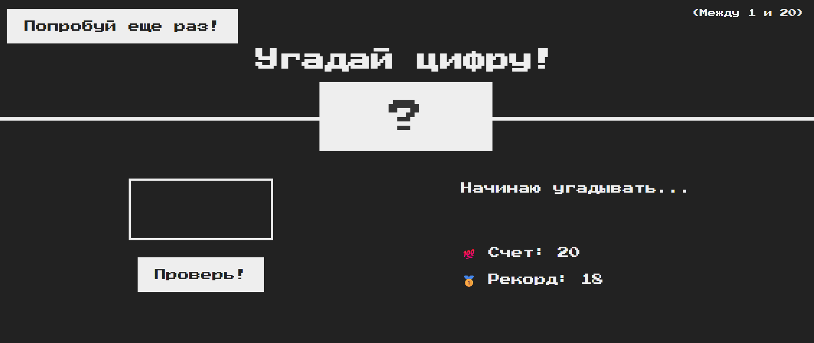
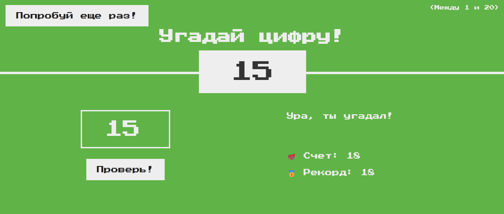

# Guess my number funny game (JS)

This is a simple game in which a user tries to guess a number between 1 and 20.

A user receives hints if the number is higher or lower than the guessed number.
The game also saves the user's high score until the browser is updated.

My goal was to practice writing JS code.

## Stack

